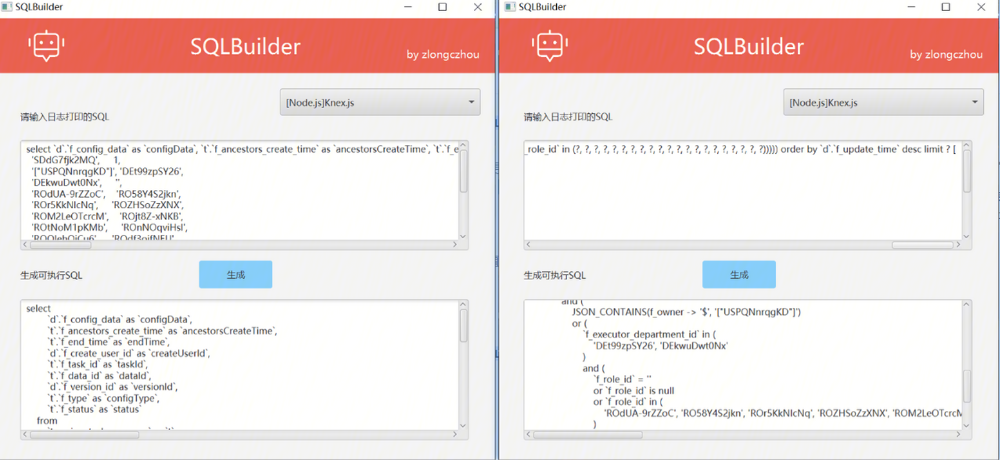

# sqlbuilder

## 介绍
这是一款 SQL 日志自动填充与格式化工具，可运行的 jar 已放在项目根目录下



## 目前功能
目前支持 Knex.js 系的 SQL 日志自动填充值与格式化SQL

## 实例
SQLBuilder可将如下代码进行转换
```sql
select d.f_config_data as configData, t.f_ancestors_create_time as ancestorsCreateTime, t.f_end_time as endTime, d.f_create_user_id as createUserId, t.f_task_id as taskId, t.f_data_id as dataId, d.f_version_id as versionId, t.f_type as configType, t.f_status as status from t_assign_task_common as t left join t_assign_task_common_data as d on t.f_data_id = d.f_data_id where (f_task_rid = ? and f_last_flag = ? and (JSON_CONTAINS(f_owner -> '$', ?) or (f_executor_department_id in (?, ?) and (f_role_id = ? or f_role_id is null or f_role_id in (?, ?, ?, ?, ?, ?, ?, ?, ?, ?, ?, ?, ?, ?, ?, ?, ?, ?, ?, ?, ?))))) order by d.f_update_time desc limit ? [
  'SDdG7fjk2MQ',     1,
  '["USPQNnrqgKD"]', 'DEt99zpSY26',
  'DEkwuDwt0Nx',     '',
  'ROdUA-9rZZoC',    'RO58Y4S2jkn',
  'ROr5KkNIcNq',     'ROZHSoZzXNX',
  'ROM2LeOTcrcM',    'ROjt8Z-xNKB',
  'ROtNoM1pKMb',     'ROnNOqviHsl',
  'ROOIehQiCu6',     'ROdf3oifNEU',
  'ROUUP7n3zjQ',     'ROjjf8VSmHQe',
  'ROBPXtLpXJ2',     'ROEZhDiOc_2A3',
  'ROP0P8rS5dHi8',   'ROIjvoTPPvswo',
  'RO1VqD635eBTe',   'ROnlteBMZpwbf',
  'ROgz9IXC6UTfI',   'ROXxXcvBkLRPr',
  'ROTbrVfHbvWph',   10
]
```

转为
```sql
select
        d.f_config_data as configData,
        t.f_ancestors_create_time as ancestorsCreateTime,
        t.f_end_time as endTime,
        d.f_create_user_id as createUserId,
        t.f_task_id as taskId,
        t.f_data_id as dataId,
        d.f_version_id as versionId,
        t.f_type as configType,
        t.f_status as status 
    from
        t_assign_task_common as t 
    left join
        t_assign_task_common_data as d 
            on t.f_data_id = d.f_data_id 
    where
        (
            f_task_rid = 'SDdG7fjk2MQ' 
            and f_last_flag = 1 
            and (
                JSON_CONTAINS(f_owner -> '\$', '["USPQNnrqgKD"]') 
                or (
                    f_executor_department_id in (
                        'DEt99zpSY26', 'DEkwuDwt0Nx'
                    ) 
                    and (
                        f_role_id = '' 
                        or f_role_id is null 
                        or f_role_id in (
                            'ROdUA-9rZZoC', 'RO58Y4S2jkn', 'ROr5KkNIcNq', 'ROZHSoZzXNX', 'ROM2LeOTcrcM', 'ROjt8Z-xNKB', 'ROtNoM1pKMb', 'ROnNOqviHsl', 'ROOIehQiCu6', 'ROdf3oifNEU', 'ROUUP7n3zjQ', 'ROjjf8VSmHQe', 'ROBPXtLpXJ2', 'ROEZhDiOc_2A3', 'ROP0P8rS5dHi8', 'ROIjvoTPPvswo', 'RO1VqD635eBTe', 'ROnlteBMZpwbf', 'ROgz9IXC6UTfI', 'ROXxXcvBkLRPr', 'ROTbrVfHbvWph'
                        )
                    )
                )
            )
        ) 
    order by
        d.f_update_time desc limit 10
```

